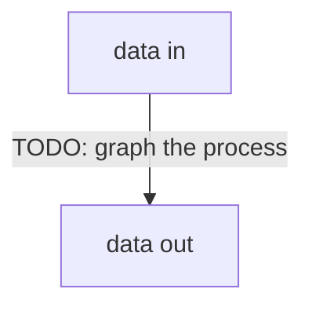

# Architecture

TODO: https://matklad.github.io/2021/02/06/ARCHITECTURE.md.html

## Invariants
- Every path v_utils creates for an app is reachable from `~/.<app>/` (unix): symlinks to the XDG base dirs (`config|data|cache|state|runtime`) and to flat settings files (`<app>.nix`, …). Data stays at XDG; the index is only links.
